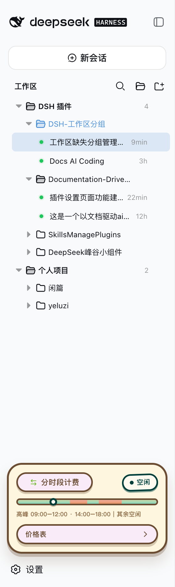

<p align="right">
  <strong>English</strong> · <a href="./README_ZH.md">简体中文</a>
</p>

# dsh-workspace-groups


> **A DeepSeek Harness (DSH) web client plugin: a complete workspace grouping manager.**
> Turns the GUI sidebar's two-level workspace list (Projects → Sessions) into a
> three-level **Category folder → Project folder → Session** tree, backed by full
> group-management capabilities: manual group creation, rename/delete of any group,
> drag-and-drop grouping, free ordering of projects and groups, rule-based
> auto-classification, and tree-shaped search. Every action takes effect
> **immediately and persists**, with **zero intrusion** on official data.


## Screenshot



## Features

### Grouped tree browsing
- **Group folder → project folder → session row**, both levels collapsible; expansion state
  persists independently (`dsh.workspace.groups.view.v1`, survives refresh/restart)
- **Top-level project rows**: ungrouped projects (matching no rule, dragged out of a group,
  or returned by a group delete) render as plain rows right after the group folders, at the
  same level — **there is no "Uncategorized" bucket**

### Group management (full lifecycle)
- **Create groups manually**: the "New group" button in the section header shows the group
  immediately (empty groups render too)
- **Rename / delete any group**: every group row (**rule categories included**) has a hover
  `⋯` menu; deleting a group sends all of its projects back to the **top level**;
  rule-category rename/delete rides the overlay (`renamed` / `hidden`),
  **the rule YAML stays untouched**
- **Rule-based auto-classification**: the sidecar YAML declares category rules (`pathPrefix` /
  `pathExact` / `nameContains` / `basenameContains`); edit the config to adjust grouping
  without touching code

### Drag-and-drop grouping + ordering
- **Drag projects into groups**: drop on any group row or on a project row inside a group
  (cross-group move = overrides the rule classification)
- **Drag projects OUT of a group**: the **entire top-level area** is the move-out drop
  target while dragging, shown with an **insertion line** (not a highlight box) — drop on
  any top-level row (reorder before/after it), on the blank space below the last row
  (append), or, when the top level is empty, a standalone line under the last group
  folder; grouped projects also have a "Move out of group" menu item (rule-classified ones included)
- **Reorder projects inside a group**: top half of a project row = insert before it,
  bottom half = insert after it
- **Reorder top-level projects**: top-level rows are draggable too — top half = insert
  before, bottom half = insert after; the top-level order persists under
  `workspaceOrder["__topLevel__"]`
- **Reorder groups**: group rows are draggable — top half of another group row = move before it,
  bottom half = move after it
- **Insertion position indicator**: a 2px line (above/below the row) shows the exact drop
  point while dragging — what you see is where it lands
- **Level-aware folding, auto-restored**: dragging a project folds every project row
  (grouped AND top-level; group rows stay expanded); dragging a group folds every group
  (project rows keep their expansion) — dragend restores the pre-drag expansion snapshot
- **Distinct row icons**: group rows use a folder glyph, project rows a project glyph
  (same as the official workspace browser) — groups and projects are easy to tell apart

### Search & operations
- **Tree-shaped search**: results keep the three-level structure (category → project → matched
  session), matched rows highlighted with a content snippet, 250ms debounce
- **No regression on workspace/session actions**: Add Workspace, project rename/delete,
  session new/open/rename/fork/archive

### Persistence & zero intrusion
- Every manual action (groups, grouping, ordering, rename, hide) is written to the plugin's own
  overlay (`~/.dsh/workspace-groups.manual.json`), validated by the host and **written
  atomically** (a malformed write returns 400 and keeps the previous file)
- **Zero intrusion**: never touches `~/.dsh/storages/workspace.json`, session on-disk
  structures, or the official `@deepseek-ai/dsh-client-ui-workspace` package; the rule YAML
  is never rewritten
- **Self-contained artifact**: `lib/` is prebuilt and shipped with the repo — installing from
  Git runs no dependency scripts

## How it works

- The plugin is a **client plugin** registered into the official sidebar shell's
  `sidebar.workspaces` slot (`kind: 'single'`) at `priority: -1`, replacing the official
  WorkspaceBrowser (registered at priority 0; lowest priority wins in a single slot).
- All data comes from the runtime API: the `useWorkspaces` / `useSessions` global hooks and
  `ctx.workspaces.*` / `ctx.sessions.*` — grouping is purely a **presentation-layer transform**.
- The host half does two things: parses the sidecar YAML and merges it with the runtime
  overlay, served to the client via `GET /workspace-groups/config` (`Cache-Control: no-cache`);
  and `PUT /workspace-groups/manual` accepts the full overlay (manual groups, per-workspace
  grouping overrides, group/project ordering, rule-category renames and hides), validates it
  and writes it atomically to `$DSH_HOME/workspace-groups.manual.json`.
- **Classification priority**: manual override (written by drag/menu; `null` = forced
  top-level, rules ignored) → YAML rule classification (hidden rule categories are inert)
  → **top level** (ungrouped projects render as top-level rows). The YAML is never
  rewritten.

## Install (GitHub distribution)

> Prerequisite: [DeepSeek Harness](https://github.com/deepseek-ai/deepseek-harness)
> installed (`dsh` available) with a target profile initialized (e.g. the built-in `web`).

```sh
dsh plugin --profile web add github:z-col/dsh-workspace-groups
```

This automatically:

1. Adds `"dsh-workspace-groups": "github:z-col/dsh-workspace-groups"` (pinned to
   version/commit) to `dependencies` in `~/.dsh/profiles/web/package.json`
2. Appends `"dsh-workspace-groups"` to `dsh.profile.bundles`
3. Runs pnpm install and validates the bundle layer

**Restart the web profile after installing** (both the bundle and the host half only load
on restart):

```sh
# Stop the running dsh web process and start it again, e.g.:
dsh web
```

Verify the install:

```sh
dsh --profile web --dump-config | grep -A3 workspace-groups
# expect: - id: workspace-groups / name: dsh-workspace-groups / config: {}
curl http://127.0.0.1:3080/workspace-groups/config
# expect: the sidecar YAML parsed as JSON
```

## Uninstall

```sh
dsh plugin --profile web remove dsh-workspace-groups
```

This removes the dependency from `dependencies` and the matching line from
`dsh.profile.bundles`. A **web profile restart** is required for it to take effect.

> Manual equivalent (pick one, don't repeat): edit `~/.dsh/profiles/web/package.json`,
> remove the `dsh-workspace-groups` line from `dependencies` and `"dsh-workspace-groups"`
> from `dsh.profile.bundles`, then run `pnpm install` in that directory.

## Classification config (sidecar)

Default location `~/.dsh/workspace-groups.yaml` (override the home dir with the
`$DSH_HOME` env var). Template: `workspace-groups.example.yaml` at the repo root.

```yaml
categories:
  - name: DSH Plugins
    rules:
      - pathPrefix: /Users/zcol/Project/SkillsManagePlugins
      - nameContains: plugin
      - basenameContains: plugin
  - name: Personal Projects
    rules:
      - pathPrefix: /Users/zcol/Project/yeluzi
```

Rule fields (each rule is an OR — any match classifies; categories are matched in order,
first match wins):

| Field | Meaning |
|---|---|
| `pathPrefix` | Project absolute path prefix |
| `pathExact` | Project absolute path exact match |
| `nameContains` | Project display title contains (case-insensitive) |
| `basenameContains` | Project directory name contains (case-insensitive) |

Projects matching no category — or moved out of a group — render as **top-level project
rows** (same level as the group folders), never hidden.

## Manual groups & drag-and-drop grouping (runtime overlay)

Besides the rule YAML there is a plugin-owned runtime overlay, **recording only manual
UI operations**, at `$DSH_HOME/workspace-groups.manual.json` (e.g. `~/.dsh/workspace-groups.manual.json`):

```json
{
  "categories": ["Scratch", "Archive"],
  "assignments": {
    "a1b2c3d4-e5f6-7890-abcd-ef1234567890": "Scratch",
    "a1b2c3d4-e5f6-7890-abcd-ef1234567891": null
  },
  "categoryOrder": ["Scratch", "DSH Plugins"],
  "workspaceOrder": { "Scratch": ["a1b2c3d4-e5f6-7890-abcd-ef1234567890"] },
  "renamed": { "DSH Plugins": "Plugin Collection" },
  "hidden": ["Docs"]
}
```

- `categories` — manually created group names (no rules; empty groups render too).
- `assignments` — workspace → group classification overrides keyed by the stable workspace id
  (renames don't affect it). **Takes precedence over YAML rules**; a value of `null` means
  **forced top-level** (even when a rule would match).
- `categoryOrder` — group display order (top-level rows are not listed here; they always
  render after the group folders).
- `workspaceOrder` — per-group manual ordering of projects (written by drag ordering).
- `renamed` / `hidden` — UI rename/delete of rule categories (a hidden category's rules become
  inert and its matches go top-level); the rule YAML stays untouched.
- The file is written in full by the browser UI (`PUT /workspace-groups/manual`, atomic
  replace); manual edits also take effect on next load. A malformed write returns 400 and
  keeps the previous file — the rule YAML is never at risk.
- The PUT contract is fail-closed: wrapped writes require both a non-empty `expectedRevision`
  and a complete `manual` object; legacy flat writes require explicit `categories` and
  `assignments`. Missing, incomplete, or mixed formats are rejected before validation or I/O.

| Action | How |
|---|---|
| Create group | "New group" button in the section header (folder icon), enter a name in the dialog |
| Rename/delete group | hover `⋯` menu on **any** group (rule categories included); deleting sends its projects back to the top level |
| Drag project into group | drag a project row onto a target group row / any project row inside a group, release to move |
| Reorder projects | drag a project row onto another project row in the same group: **top half = insert before, bottom half = insert after** (indicator shows the spot); all project rows fold while dragging and restore on dragend |
| Reorder top-level projects | drag a top-level row onto another top-level row: **top half = insert before, bottom half = insert after**; order persists under `workspaceOrder["__topLevel__"]` |
| Move out of a group | drop anywhere on the **top-level area** (an insertion line shows the spot — reorder before/after a top-level row, or append below the last row; when the top level is empty a line shows under the last group), or the project row's "Move out of group" menu (forced top-level) |
| Reorder groups | drag a group row onto another group row: **top half = move before, bottom half = move after** (indicator shows the spot; all groups fold while dragging, restored on dragend) |

## Topics

This repo targets automatic discovery by the DSH plugin ecosystem (community marketplaces
scan GitHub topics). Already set:

- `dsh-plugin` (core tag; [1024Store](https://github.com/imsai-sh/awesome-deepseek-harness-plugins)
  and similar marketplaces discover by this topic periodically, validating
  `package.json` + the plugin bundle manifest (`cordis.patch.yml`))
- `deepseek-harness` / `deepseek-harness-plugin` / `dsh`
- `sidebar` / `workspace` / `workspace-groups`

`package.json` also provides `keywords` for npm/search indexing.

## Development

```sh
pnpm install
pnpm typecheck   # host + client dual-program type checking
pnpm test        # core rules, overlay, tree derivation unit tests
pnpm build       # build lib/ (node half + client bundle)
pnpm watch       # tsdown watch (client HMR)
node scripts/verify-groups.mjs   # real-browser CDP verification (host restarted; self-spawns a headless Chrome, auto-restores the scene)
```

Artifact contract (mirrors the official client packages):

- `lib/index.js` — host half (ESM; reads the sidecar + `/workspace-groups/config` route;
  js-yaml inlined, no runtime dependencies)
- `lib/client.js` — browser half (`window.__ModuleLoader__.load({id, factory})`; only
  requires platform seeds: react / react/jsx-runtime / @deepseek-ai/dsh-client-runtime/client /
  @deepseek-ai/dsh-client-ui-primitives; cross-plugin value imports are rejected at build
  time by the purity gate)
- `lib/types/**` — declaration files

> Release strategy: `lib/` build artifacts are committed (no `prepare` script), so
> `dsh plugin add github:...` never runs third-party build scripts — install and use.

## Repository layout

```
src/
  index.ts              # host half: config snapshot route + manual write route
  host-config.ts        # sidecar YAML reading/validation
  host-manual.ts        # runtime overlay read/write/validation (atomic publish)
  context-types.ts      # host-side cordis service structure types
  core/
    types.ts            # config types (shared by both halves)
    matcher.ts          # classification + manual override priority + ordering pure functions (shared)
  client/
    index.ts            # apply: registers sidebar.workspaces (priority -1)
    contract.ts         # injected surface types
    stores.ts           # expansion-state store (persist: dsh.workspace.groups.view.v1)
    tree.ts             # three-level tree derivation + tree search derivation
    GroupsBrowser.tsx   # browser region component (group dialogs + drag grouping/ordering + insertion indicator)
    rows.tsx            # category/project/session/search-result rows (drag sources/targets)
    locales.ts          # locale key contract and dictionary exports
    locales/en.ts       # primary English dictionary
    locales/zh.ts       # optional Simplified Chinese dictionary
    styles.css          # inline styles
tests/
  core.test.ts          # classification rules + override priority + moveBefore/moveAfter + config parsing
  manual.test.ts        # overlay validation + atomic file round-trip
  tree.test.ts          # tree derivation rendering contract (manual group empty render / override priority)
  store.test.ts         # expansion semantics (collapse writes false, never deletes the key)
scripts/
  verify-groups.mjs     # real-browser CDP verification (self-spawns headless Chrome, auto-restores the scene)
```

> Development docs (`docs/` five-level framework and `AGENTS.md`) are engineering files for
> development, **not shipped with the repo** (excluded via `.gitignore`).

## Verification record

- v0.1/v0.2 real-combination verification (headless Chrome + CDP): three-level tree takeover,
  correct classification, expansion persistence, search keeps workspace membership;
  `workspace.json` / session on-disk / official store: zero intrusion.
- v0.3 real-browser verification 24/24 (`scripts/verify-groups.mjs`: create group / drag /
  order / collapse / rule-category menu / rename / delete-back-to-top-level /
  scene restore; zero-intrusion assertions).
- v0.4 real-browser verification 30/30 (added: insertion indicator, project/group
  **downward drag** (bottom half → insert after the target), group upward drag (top half →
  move before the target); scene restored).
- v0.4.1 real-browser verification 34/34 (added: dragging projects OUT of a group —
  top-level drop zone / top-level rows = forced top-level; grouped projects get the
  "Move out of group" menu item).
- v0.5 real-browser verification 35/35 (model change: **no "Uncategorized" bucket** — top-level
  project rows, group delete returns members to the top level, drag/menu move-out to the
  top level, no uncategorized bucket anywhere in the tree; scene restored).
- v0.6 real-browser verification 40/40 (added: **level-aware folding** — dragging a project
  folds project rows only (group rows stay open), dragging a group folds group rows only;
  dragend restores the pre-drag expansion snapshot).
- v0.6.1 real-browser verification 42/42 (added: the whole top-level area as the move-out
  drop target with a visible landing highlight; distinct folder-vs-project row icons;
  scene restored).
- v0.7 real-browser verification 46/46 (added: top-level landing shown with an **insertion
  line** instead of a highlight box — reorder before/after a top-level row, append below
  the last row, or a standalone line when the top level is empty; **top-level projects are
  reorderable** with their order persisted under `workspaceOrder["__topLevel__"]`; also
  fixed a host validation bug that rejected `__topLevel__` and a drop-positioning bug where
  dropping between two top-level rows landed above the first; scene restored).
- 83 unit tests green (vitest: `core` / `manual` / `tree` / `store`).
- Reproducible automated verification: `node scripts/verify-groups.mjs` (host restarted).

## License

MIT
