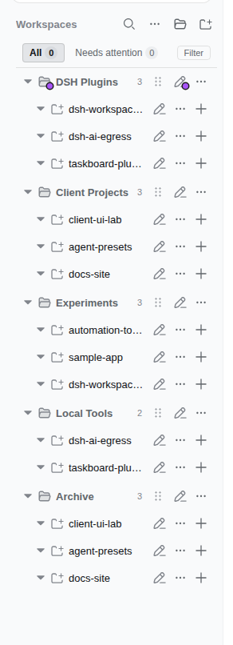
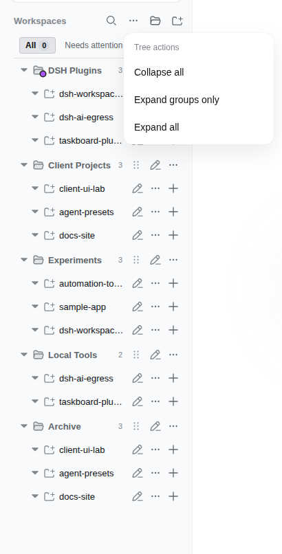
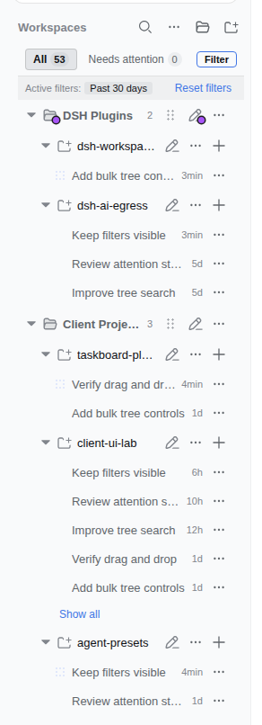

<p align="right">
  <a href="./README.md">English</a> · <strong>Русский</strong> · <a href="./README_ZH.md">简体中文</a>
</p>

# dsh-workspace-groups

Рабочие пространства и сессии DeepSeek Harness в одном дереве: **группа → workspace → сессия**.
Плагин заменяет стандартный список в боковой панели DSH Web. Группы можно создавать вручную или получать по правилам, проекты — перетаскивать, а важные разговоры — отмечать цветом и закреплять.

**Целевая версия: DSH 0.1.5-rc.2.** Старые сборки плагина для DSH 0.1.1 несовместимы с этим клиентским загрузчиком. Совместимость с произвольными более новыми версиями не заявляется.

[Возможности](#возможности) · [Установка](#установка) · [Настройка](#настройка-групп) · [Разработка](#разработка) · [Ограничения](#ограничения)

## Для чего использовать

| Задача | Что сделать |
|---|---|
| Не потерять важный разговор | Поставить сессии цвет: она останется видимой за пределами первых пяти строк |
| Держать разговор первым | Закрепить через меню сессии |
| Найти то, что ждёт ответа | Включить **Needs attention**, при необходимости добавить цвет и период |
| Разложить проекты | Создать группу и перетащить проекты или добавить workspace сразу в неё |
| Уменьшить список | Свернуть ветки либо просмотреть и архивировать неактивные сессии |

## Примеры интерфейса

Исторические снимки с демонстрационными названиями. Они сделаны до миграции на DSH 0.1.5, не показывают новые цветовые кнопки сессий и не служат проверкой текущей сборки.

| Дерево проектов | Управление ветками | Фильтры |
|:---:|:---:|:---:|
|  |  |  |

## Возможности

### Группы и порядок

- Создание, переименование и удаление групп, включая группы из правил. Удаление группы возвращает проекты на верхний уровень; YAML не переписывается.
- Добавление workspace прямо в выбранную группу через кнопку строки или её меню.
- Перетаскивание проектов между группами и на верхний уровень. Положение относительно середины строки задаёт вставку до или после неё.
- Ручной порядок групп и проектов сохраняется. Линия вставки показывает место назначения, а раскрытие веток не меняется во время перетаскивания.
- Проекты без группы показываются после групп, без отдельной папки «Неклассифицированное».
- **Collapse all** (отдельная кнопка «Свернуть всё» в шапке и пункт меню), **Expand groups only**, **Expand all** управляют всем деревом. **Alt/Option + клик** по стрелке группы раскрывает или сворачивает её вместе с проектами.
- Состояние раскрытия хранится отдельно от стандартной панели: `dsh.workspace.groups.view.v1`.

### Цветовые напоминания и закрепление

При наведении на группу, workspace или сессию появляется кнопка цвета. Доступны восемь меток: красная, оранжевая, жёлтая, зелёная, голубая, синяя, фиолетовая и розовая. Цвет можно снять тем же меню; в поиске используются те же элементы управления. Цвета группы, workspace и сессий независимы. Workspace показывает только свой цвет в дереве, поиске и выборе workspace; после сброса значок нейтральный, цвет группы не наследуется.

В раскрытом workspace по умолчанию видны **первые пять сессий плюс текущая, закреплённые и отмеченные цветом**. Кнопка **Show all / Collapse** временно раскрывает весь список. Закреплённые сессии перемещаются в начало своего workspace и отмечаются значком булавки.

Цвет — ручное напоминание. Он не меняет статус работы агента и не заменяет закрепление.

### Иконки папок и смысловые названия

Выберите **Choose icon** в меню `⋯` группы/workspace (нажатие на значок в строке только раскрывает или сворачивает её): 39 встроенных SVG-значков — 38 Tabler Outline и кит DeepSeek/DSH из Lobe Icons. Среди животных есть кот, собака, рыба, бабочка, лошадь и лапа. Есть сброс к стандартному значку. Выбор разбит на разделы: техника, голос и медиа, разработка, документы и команды, животные, дополнительные. Для технических проектов добавлены микрофон, звуковая волна, мозг, CPU, сеть, плагины, мониторинг и Git. В этом же окне есть палитра и предпросмотр: выберите иконку и цвет в любом порядке, затем нажмите **Save**. **Close** или Escape отменяют изменения; стандартный значок и цвет можно сбросить независимо. Отдельное меню цвета остаётся быстрым доступом. Значки видны и в поиске, сохраняются после обновления страницы и переименования группы. Цвет окрашивает сам значок папки; у сессий остаются цветовые точки. Настройки хранятся раздельно в `groupIcons` и `workspaceIcons`. Внешние картинки и загрузка произвольного SVG не используются. Для сохранения нужна совместимая пара Host + Client: старый Host эти поля не поддерживает.

Единый выбор **Choose workspace** раскрывается как **группа → workspace**, с иконками, цветами, счётчиками, поиском и кнопкой назад. Поиск на первом уровне находит workspace во всех группах; вход в группу сам по себе не меняет фильтры и разговор. Выбор workspace вызывает штатный `uiWorkspace.openWorkspace` (DSH может переиспользовать или создать его пустую сессию), раскрывает ветку и очищает статус/цвет/период, чтобы выбранный workspace был виден; текст поиска сохраняется. **All workspaces in this group** только ограничивает дерево группой; **All workspaces** снимает диапазон. **Top level** содержит workspace без группы. Ошибка остаётся в меню; повторный переход во время ожидания запрещён. Поддерживаются стрелки, Escape, закрытие снаружи и сенсорные строки от 44px. Диапазон сохраняется после обновления страницы; удалённые значения сбрасываются после загрузки данных. Полный заголовок сессии виден при наведении.

Из исходного репозитория (не из готового npm-пакета) для DSH 0.2.0-rc.1 команда `node scripts/prepare-020.mjs <empty-staging-path>` создаёт совместимое дерево исходников; в нём нужно установить опубликованные зависимости через `pnpm install --ignore-scripts --frozen-lockfile`, собрать и проверить результат перед установкой. Обычная сборка для 0.1.5 не взаимозаменяема с этим артефактом. Новые записи профиля требуют патча `insert`: переопределение неизвестного id не создаёт плагин. Установка требует отдельного разрешения и сохранения авторизации и активных сессий.

Отдельный [плагин периодических названий](packages/periodic-titles/README.md) предназначен для **DSH 0.2.0-rc.1**, независимо от совместимости панели с 0.1.5. Он даёт смысловое название через штатный сервис и пересматривает его после пяти новых содержательных сообщений пользователя, когда ход успешно завершён. Ручное название закрепляется; короткие подтверждения не считаются. Для длинной истории выбираются целые сообщения в пределах бюджета, с приоритетом последних. Если последнее сообщение слишком велико или генерация завершилась ошибкой, прежнее название сохраняется. Каждая генерация — отдельный запрос к модели. Нужны отдельная установка и активация в профиле с заменой прежнего провайдера названий; установка панели сама по себе это не включает.

### Поиск и фильтры

Поиск сохраняет дерево групп и проектов, выделяет совпадения и показывает фрагменты найденного содержимого. Задержка ввода — 250 мс.

| Фильтр | Поведение |
|---|---|
| **All** | Все подходящие сессии |
| **Needs attention** | Ожидание действия пользователя или ошибка |
| **Running** | Работающая сессия или её работающие подагенты |
| **New** | Неоткрытый результат завершённой работы |
| Цвет | Совпадение группы, workspace или его видимой дочерней сессии |
| Период | Последний час, 3/24 часа, 7/30/90 дней или свой диапазон дат |

Текст, статус, цвет и время применяются совместно. Под единым выбором workspace расположены отдельная палитра с подписями (все цвета и восемь образцов) и выбор периода с иконками часов/календаря. Текущие значения видны на кнопках. **Custom range…** открывает календари «от — до»; обе даты включаются целиком по локальному часовому поясу. Точные границы сохраняются между браузерами; Apply применяет выбор, Cancel ничего не меняет. Нужны совместимые Host и Client; быстрый период и сброс удаляют свой диапазон. Кнопка сброса с иконкой стоит в заголовке активных фильтров; после сброса фокус возвращается на All, текст поиска сохраняется, а пустая отфильтрованная выдача сообщает об отсутствии совпадений. Панель фильтров остаётся над прокручиваемым деревом. Условия сохраняются через сервис настроек активного DSH-профиля; другая уже открытая вкладка прочитает их при следующей загрузке страницы.

Раскрытие веток во время фильтрации временное и не перезаписывает сохранённое состояние обычного дерева.

### Статусы внимания

**Awaiting** отмечает ожидающее взаимодействие или ответ на запрос согласования. **Error** отмечает ошибку, прерывание или завершение по лимиту токенов. Свёрнутые группы и workspace показывают наиболее приоритетный статус дочерних сессий.

Явное открытие строки сессии убирает её текущий Error в этом браузере; отметка просмотра сохраняется после обновления страницы. Восстановление выбранного чата после перезагрузки не снимает Error. Новая ошибка в уже выбранном чате остаётся видимой до повторного открытия его строки. При изменении ревизии сессии Error может появиться снова. Открытие строки само по себе не снимает Awaiting. Для Error нужна причина завершения от DSH, а не просто переход из работающего состояния в неактивное.

Плагин читает `uiSession.pendingInteractions` и поддерживаемую платформой инкрементальную проекцию. Для этого не сканируются журналы разговоров и не добавляются запросы списка сессий.

### Операции и очистка

Сохраняются штатные операции: добавление, переименование и удаление workspace; создание, открытие, переименование, ответвление и архивирование сессий. Удаление регистрации workspace не удаляет каталог или журналы сессий.

Очистка доступна из общего меню дерева и из меню отдельного workspace. Можно выбрать 7, 14, 30, 60, 90 дней или свой порог, просмотреть кандидатов и подтвердить архивирование.

Перед **каждым** архивированием заново проверяются возраст, работа агента, ожидающее взаимодействие, текущая сессия, существующая архивация и принадлежность выбранному workspace. Пустые сессии и подагенты исключаются. Если выбранный workspace исчез, очистка не превращается в глобальную. Цвет и закрепление сами по себе не защищают от очистки.

## Установка

Нужны установленный **DSH 0.1.5-rc.2** и инициализированный Web-профиль. Вместо `web` укажите имя своего профиля.

```sh
dsh plugin --profile web add github:PavelLizunov/dsh-workspace-groups
```

Команда добавляет зависимость и bundle плагина в профиль. В Git хранится готовый `lib/`, поэтому для установки не нужен локальный исходный код DSH или repair-каталог.

**Первичная активация или обновление серверной части требует отдельно запланированного перезапуска существующего профиля.** Он может прервать активные чаты и задания. Не запускайте второй сервер вместо обновления первого.

Проверка после согласованной активации:

```sh
dsh --profile web --dump-config
# В конфигурации должна быть запись dsh-workspace-groups.
```

В авторизованном браузере DSH откройте `/workspace-groups/config`: ответ содержит `categories`, `manual` и `revision`. Неавторизованный запрос должен получить 401. Не отключайте аутентификацию ради проверки.

### Обновление без перезапуска

Обновление только клиента возможно через HMR, **если существующий watcher следит именно за установленным bundle**. Сначала проверяются таблица модулей и API целевой платформы. Наличие HMR не делает несовместимый файл безопасным.

Git push и `pnpm watch` в другом каталоге не обновляют установленный плагин. Обновление работающего профиля — отдельная операция, не часть публикации репозитория.

### Удаление

```sh
dsh plugin --profile web remove dsh-workspace-groups
```

Удаление зависимости и bundle применяется после отдельно согласованного перезапуска профиля. Ручной эквивалент — убрать соответствующую зависимость и запись `dsh.profile.bundles` из manifest профиля и обновить его зависимости. Не выполняйте оба способа подряд.

## Настройка групп

Правила находятся в `$DSH_HOME/workspace-groups.yaml`, обычно `~/.dsh/workspace-groups.yaml`. Пример: [`workspace-groups.example.yaml`](./workspace-groups.example.yaml).

```yaml
categories:
  - name: Plugins
    rules:
      - pathPrefix: /home/user/projects/plugins
      - nameContains: plugin
  - name: Documentation
    rules:
      - basenameContains: docs
```

| Поле | Что сопоставляется |
|---|---|
| `pathPrefix` | Префикс абсолютного пути проекта |
| `pathExact` | Точное совпадение абсолютного пути |
| `nameContains` | Часть названия проекта без учёта регистра |
| `basenameContains` | Часть имени каталога без учёта регистра |

Условия работают как OR, группы проверяются по порядку до первого совпадения. Ручное назначение имеет приоритет над правилами. Значение `null` принудительно оставляет workspace на верхнем уровне.

## Где хранятся изменения

Группировка — преобразование представления. Плагин не редактирует файлы основных хранилищ DSH или исходники официальной панели напрямую; обычные операции выполняются через API платформы.

Ручные настройки хранятся в `$DSH_HOME/workspace-groups.manual.json`:

```json
{
  "categories": ["Important"],
  "assignments": { "workspace-example": "Important" },
  "categoryOrder": ["Important"],
  "workspaceOrder": { "Important": ["workspace-example"] },
  "colors": { "workspace-example": "blue", "session-example": "red" },
  "pinnedSessions": { "workspace-example": ["session-example"] },
  "renamed": {},
  "hidden": []
}
```

Это пример схемы: замените демонстрационные ID реальными.

- `categories` — ручные группы; пустые группы тоже видны.
- `assignments` — назначение workspace в группу или `null` для верхнего уровня.
- `categoryOrder`, `workspaceOrder` — порядок; ключ `__topLevel__` хранит порядок проектов вне групп.
- `colors` — цвет по имени группы, ID workspace или ID сессии.
- `pinnedSessions` — упорядоченные ID закреплённых сессий по workspace.
- `renamed`, `hidden` — переименование и скрытие групп из правил без изменения YAML.

Сервер валидирует полную запись и сохраняет её атомарно. Некорректный запрос возвращает 400; конфликт ревизий — 409. Обёрнутый PUT требует `manual` и непустую `expectedRevision`; прежний плоский формат требует `categories` и `assignments`. Все три маршрута конфигурации, настроек фильтров и ручной записи используют штатную проверку авторизации DSH до доступа к данным.

## Разработка

Основной репозиторий: [PavelLizunov/dsh-workspace-groups](https://github.com/PavelLizunov/dsh-workspace-groups). Исторические repair-папки не нужны для сборки и не являются второй рабочей версией.

Инструменты: **Node.js 22.18+**, **pnpm 11.22.0**. Зависимости DSH фиксированы на 0.1.5-rc.2.

```sh
pnpm install --frozen-lockfile --ignore-scripts
pnpm build
pnpm verify
```

| Команда | Что проверяет или создаёт |
|---|---|
| `pnpm typecheck` | Типы серверного кода, клиента и тестов |
| `pnpm test` | Unit- и DOM-тесты |
| `pnpm test:loader` | Отклонение старого external и загрузку нового клиента реальным loader DSH |
| `pnpm test:consumer` | Декларации, упаковку, установку tarball в отдельный каталог и загрузку установленного клиента |
| `pnpm build` | `lib/index.js`, `lib/client.js`, source map и декларации |
| `pnpm watch` | Пересборку текущего checkout, без автоматического развёртывания |

`lib/` коммитится вместе с исходниками. Клиент обращается к платформенным модулям, включая `dsh-client-store`; другие межплагинные value-import блокируются при сборке. Host встраивает `js-yaml`, но использует пакетные `zod` и `schemastery`.

### Карта кода

```text
src/index.ts                 HTTP-маршруты, авторизация и настройки
src/host-*.ts                YAML, валидация, атомарное сохранение
src/core/                    Правила группировки, порядок и внимание
src/client/index.ts          Подключение к sidebar.workspaces и API DSH
src/client/GroupsBrowser.tsx  Дерево, поиск, фильтры и диалоги
src/client/rows.tsx          Строки групп, проектов и сессий
src/client/tree*.ts          Построение и фильтрация дерева
src/client/session-*.ts      Ограничение списка и кандидаты очистки
tests/                       Поведение, DOM, авторизация и гонки очистки
tests/consumer/              Упаковка и регрессия загрузчика
```

Правила сопровождения: [`AGENTS.md`](./AGENTS.md). Документация RU/EN/ZH должна соответствовать одному поведению. `package.json` содержит ключевые слова для поиска плагина; GitHub topics могут использоваться каталогами сообщества.

## Границы проверки

Loader-тест использует настоящий загрузчик DSH 0.1.5 и сверяет ID с опубликованным shell, но подставляет mock-экспорты платформы. Это не полная проверка авторизованного браузера. DOM-тесты проверяют взаимодействия компонентов, но не заменяют интеграцию с работающим профилем.

Скрипт `scripts/verify-groups.mjs` — отдельная, необязательная CDP-проверка с изменением тестовой сцены; запускайте только в согласованном тестовом профиле. Миграция репозитория сама по себе не означает развёртывание или проверку live GUI.

## Ограничения

- Совпадение цвета дочерней сессии включает её workspace в результат. Другие сессии этого workspace могут остаться видимыми, если подходят по статусу и времени.
- Ручной цвет не переносится на свёрнутые родительские строки; автоматические статусы внимания переносятся. У пустой сессии нет цветового меню.
- Имена групп и ID используют общую карту `colors`: одинаковые ключи могут конфликтовать. Миграция пространства ключей не включена.
- Архивирование не удаляет сохранённые цвета. Цветовая метка не защищает от очистки.
- UI-словари — английский и упрощённый китайский. Этот README не добавляет русскую локализацию интерфейса.
- Проверка загрузчика не гарантирует совместимость с будущими релизами DSH.

## Авторство и лицензия

Основа проекта — [z-col/dsh-workspace-groups](https://github.com/z-col/dsh-workspace-groups). Исходное авторство и лицензия сохранены: [MIT](./LICENSE).
