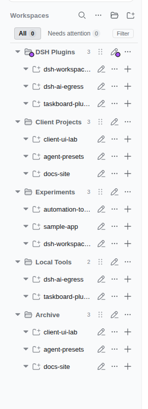
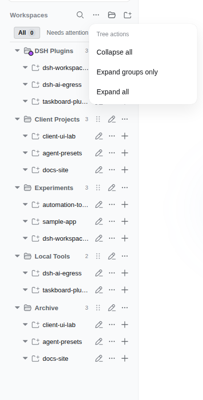
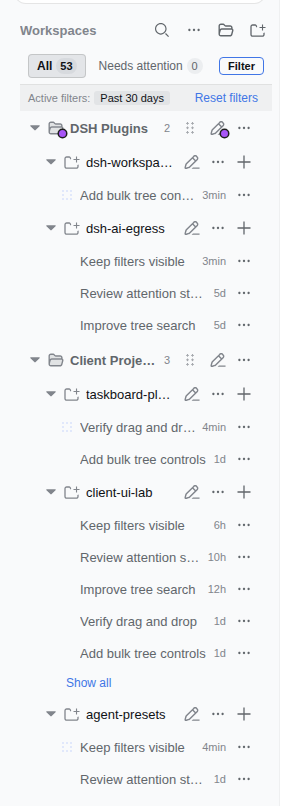

<p align="right">
  <a href="./README.md">English</a> · <strong>简体中文</strong>
</p>

# dsh-workspace-groups


> **DeepSeek Harness (DSH) 侧边栏工作区分组插件。**
> 将 DSH Web 侧边栏工作区列表升级为三层 **「分类文件夹 → 项目文件夹 → 会话」** 树状结构，提供 **拖拽排序（Drag-and-drop ordering）**、**注意力筛选（Attention filters，按状态/颜色/时间）** 和 **树形搜索（Tree search）**。支持手动分组管理、规则自动归类、Sidecar YAML 配置与运行时 Overlay 持久化，对官方核心数据 **零侵入**。

典型场景：多个 DSH 插件项目（SkillsManagePlugins / Documentation-Driven AI Coding /
DeepSeek峰谷小组件 等）归入一个「DSH 插件」分类文件夹，点开是各项目，再点开是各自会话；
临时项目随手建个「临时」分组拖进去，用完删除分组，项目全部回归**顶层**。

## 快速安装 (Quick Install)

```sh
dsh plugin --profile web add github:PavelLizunov/dsh-workspace-groups
```

> 激活插件需要通过现有的服务或进程管理方式重启当前 web profile。验证与卸载说明见后文 [安装（GitHub 分发）](#安装github-分发)。

## 当前界面

截图来自当前 DSH Web 构建；工作区与会话名称已替换为保护隐私的演示名称。

| 分组侧边栏 | 批量树形控制 | Finder 风格筛选 |
| :---: | :---: | :---: |
|  |  |  |

## 特性

### 分组树浏览
- **分组文件夹 → 项目文件夹 → 会话行**，分组/项目均可折叠；展开状态独立持久化
  （`dsh.workspace.groups.view.v1`，刷新/重启保留）
- **批量树形控制与快捷键**：提供全局 **折叠全部**、**仅展开分组** 和 **展开全部** 操作；支持单分组递归命令以及按住 **Option 键** (macOS) / **Alt 键** (Windows/Linux) 点击分组折叠/展开箭头，一次性递归折叠或展开该分组及其内部的所有项目文件夹（详见 [BULK_TREE_CONTROLS_SPEC.md](./BULK_TREE_CONTROLS_SPEC.md)）
- **顶层项目行**：不归组的项目（不匹配任何规则、被移出分组、删除分组后回归的）
  直接显示在分组列表之后，与分组平级——**没有「未分类」桶**
- **状态逐级汇总**：折叠的项目或分组显示子会话最高优先级状态（等待操作 → 运行中 → 未读完成）
- **会话行限制**：项目展开后默认显示五行（必要时另加当前会话），并提供临时的
  **展开全部 / 折叠** 控件

### 分组管理（完整生命周期）
- **手动新建分组**：区头「新建分组」按钮即建即显，空分组也渲染
- **重命名 / 删除任意分组**：每个分组行（**含规则分类**）悬停 `⋯` 菜单；
  删除分组后组内所有项目回到**顶层**；规则分类的改名/删除经 overlay 生效
  （`renamed` / `hidden`），**规则 YAML 原样保留**
- **规则自动归类**：sidecar YAML 声明分类规则（`pathPrefix` / `pathExact` /
  `nameContains` / `basenameContains`），改配置即可调整归类，无需改代码

### 拖拽归类 + 排序
- **拖项目进分组**：拖到任意分组行 / 分组内项目行即移入（跨组移动 = 覆盖规则归类）
- **从分组拖出**：拖动时**整个顶层区域都是移出落点**，用**插入横线**指示（非高亮框）——
  拖到任意顶层项目行（插到它前/后）、拖到最后一行下方空白（追加末尾）、顶层为空时
  在最后一个分组行下方显示独立横线 = 移出分组；分组内项目行的菜单「移出分组」
  （规则归类项目也有）
- **项目组内排序**：拖到项目行上半 = 插到它前面、下半 = 插到它后面
- **顶层项目排序**：顶层项目行也可拖拽排序（上半 = 插到它前、下半 = 插到它后），
  顺序持久化在 `workspaceOrder["__topLevel__"]`
- **分组排序**：分组行可拖动，拖到另一分组行上半 = 移到它前面、下半 = 移到它后面
- **插入位置指示线**：拖动中实时显示 2px 指示线（行上/下方），松手落点所见即所得
- **拖动时保持展开状态稳定**：项目行和分组行在拖放期间保持当前展开状态，
  避免原生 dragstart 时源行在指针下方发生位移
- **行图标可区分**：分组行是文件夹图标、项目行是项目符号图标（官方同款），
  分组与项目一眼可分

### 搜索、筛选与操作
- **树形搜索**：命中后仍保留三层树结构（分类 → 项目 → 命中会话），命中行高亮 +
  内容摘要，防抖 250ms
- **Finder 风格筛选**：状态范围可切换 **全部 / 需要处理 / 运行中 / 新结果**；筛选菜单
  可再选择一种分组/项目颜色，以及最近 24 小时、7 天或 30 天。文本、状态、颜色与时间
  条件共同收窄结果。
- **按 Profile 持久化筛选**：状态、颜色与时间条件保存在当前 DSH Profile 中，刷新页面或
  使用另一浏览器时会恢复。已打开的浏览器将在下次加载页面时读取最新设置。
- **条件可见、展开临时**：启用的条件始终显示，并提供统一重置；空分支隐藏，筛选树沿用
  当前展开状态并可正常折叠。筛选期间的展开操作仅临时生效，不改变保存的空闲状态。筛选后的
  搜索结果仍采用五行预览与**展开全部 / 折叠**。
- **固定筛选栏与 Chip**：状态范围栏、筛选菜单与已启用条件 Chip 在视图区域上方固定放置，
  树视图滚动时保持置顶。
- **工作区/会话操作不退化**：Add Workspace、项目重命名/删除、新建/打开/重命名/
  派生/归档会话。

### 持久化与零侵入
- 所有手动操作（分组、归类、排序、改名、隐藏）写入插件自有 overlay
  （`~/.dsh/workspace-groups.manual.json`），host 校验后**原子写入**（写坏返回 400 并
  保留原文件）
- 筛选选择通过官方 Profile settings 服务保存，不直接编辑任何 settings 文件。
- **零侵入**：不修改 `~/.dsh/storages/workspace.json`、不修改会话落盘结构、不修改官方
  `@deepseek-ai/dsh-client-ui-workspace` 包；规则 YAML 永不改写
- **产物自包含**：`lib/` 已构建并随仓库分发，Git 安装无需执行任何依赖脚本

## 工作原理

- 本插件是 **client 插件**，注册进官方 sidebar shell 声明的 `sidebar.workspaces`
  slot（`kind: 'single'`），以 `priority: -1` 顶替官方默认 WorkspaceBrowser
  （官方以 priority 0 注册；single 槽位最低 priority 胜出）。
- 数据源全部复用运行时 API：`useWorkspaces` / `useSessions` 全局 hooks 与
  `ctx.workspaces.*` / `ctx.sessions.*`，分类只是**展示层变换**。
- host 半做两件事：把 sidecar YAML 解析为 JSON 与运行时 overlay 合并，经
  `GET /workspace-groups/config` 路由（`Cache-Control: no-cache`）供 client 获取；
  `PUT /workspace-groups/manual` 接收整份 overlay（手动分组、每工作区归类覆盖、
  分组/项目排序、规则分类改名与隐藏），校验后原子写入
  `$DSH_HOME/workspace-groups.manual.json`。
- **归类优先级**：手动覆盖（拖拽/菜单写入；`null` = 强制顶层、规则匹配也无效）→
  YAML 规则自动归类（被隐藏的规则分类失效）→ **顶层**（不归组的项目显示为顶层行）。
  YAML 永不改写。

## 安装（GitHub 分发）

> 前置：已安装 [DeepSeek Harness](https://github.com/deepseek-ai/deepseek-harness)
> （`dsh` 命令可用），并已初始化好目标 profile（如内置 `web`）。

```sh
dsh plugin --profile web add github:PavelLizunov/dsh-workspace-groups
```

这会自动：

1. 在 `~/.dsh/profiles/web/package.json` 的 `dependencies` 加入
   `"dsh-workspace-groups": "github:PavelLizunov/dsh-workspace-groups"`（含版本/commit）
2. 在 `dsh.profile.bundles` 末尾追加 `"dsh-workspace-groups"`
3. 运行 pnpm 安装并校验 bundle 层

**安装后重启当前 web profile**（bundle 与 host 半只有在重启后才会被加载）。请使用
管理现有实例的服务/进程管理器；若以前台方式运行，请先停止当前 `dsh web`，再重新启动。

验证安装：

```sh
dsh --profile web --dump-config | grep -A3 workspace-groups
# 应出现 - id: workspace-groups / name: dsh-workspace-groups / config: {}
curl http://127.0.0.1:3080/workspace-groups/config
# 应返回 sidecar YAML 解析后的 JSON
```

## 卸载

```sh
dsh plugin --profile web remove dsh-workspace-groups
```

这会自动从 `dependencies` 删除该依赖并从 `dsh.profile.bundles` 移除对应行。
同样需要**重启 web profile** 后生效。

> 手动等价做法（任选其一，不要重复）：编辑 `~/.dsh/profiles/web/package.json`，
> 从 `dependencies` 删除 `dsh-workspace-groups` 行、从 `dsh.profile.bundles`
> 删除 `"dsh-workspace-groups"`，然后在该目录 `pnpm install`。

## 分类配置（sidecar）

默认位置 `~/.dsh/workspace-groups.yaml`（也可用 `$DSH_HOME` 环境变量覆盖家目录）。
模板见仓库根目录 `workspace-groups.example.yaml`。

```yaml
categories:
  - name: DSH 插件
    rules:
      - pathPrefix: /home/user/projects/SkillsManagePlugins
      - nameContains: 插件
      - basenameContains: plugin
  - name: 个人项目
    rules:
      - pathPrefix: /home/user/projects/yeluzi
```

规则字段（每个 rule 是 OR 关系，任一命中即归类；分类按序匹配，先到先得）：

| 字段 | 含义 |
|---|---|
| `pathPrefix` | 项目绝对路径前缀 |
| `pathExact` | 项目绝对路径精确匹配 |
| `nameContains` | 项目显示标题包含（忽略大小写） |
| `basenameContains` | 项目目录名包含（忽略大小写） |

未命中任何分类、或被移出分组的项目显示为**顶层项目行**（与分组平级），不会被隐藏。

## 手动分组与拖拽归类（runtime overlay）

规则 YAML 之外，还有一份插件自有的运行时 overlay，**只记录 UI 里的手动操作**，
默认位置 `$DSH_HOME/workspace-groups.manual.json`（例如 `~/.dsh/workspace-groups.manual.json`）：

```json
{
  "categories": ["临时", "归档"],
  "assignments": {
    "a1b2c3d4-e5f6-7890-abcd-ef1234567890": "临时",
    "a1b2c3d4-e5f6-7890-abcd-ef1234567891": null
  },
  "categoryOrder": ["临时", "DSH 插件"],
  "workspaceOrder": { "临时": ["a1b2c3d4-e5f6-7890-abcd-ef1234567890"] },
  "renamed": { "DSH 插件": "插件集" },
  "hidden": ["文档"]
}
```

- `categories` —— 手动新建的分组名（无规则，空分组也渲染）。
- `assignments` —— 工作区 → 分组的归类覆盖，键是稳定的工作区 id（重命名不影响）。
  **优先级高于 YAML 规则**；值为 `null` 表示**强制移到顶层**（即使规则能匹配）。
- `categoryOrder` —— 分组显示顺序（顶层项目不在此列，恒显示在分组之后）。
- `workspaceOrder` —— 每个分组内项目的手动排序（拖拽排序写入）。
- `renamed` / `hidden` —— 规则分类的 UI 改名/删除（隐藏后其规则失效，匹配项目
  变顶层）；规则 YAML 原样保留。
- 文件由浏览器 UI 全量写入（`PUT /workspace-groups/manual`，原子替换），手工编辑
  同样生效（下次加载时读取）；写坏会返回 400 并保留原文件，不会破坏规则 YAML。

| 操作 | 入口 |
|---|---|
| 新建分组 | 区头「新建分组」按钮（文件夹图标），弹窗输入名称 |
| 重命名/删除分组 | **任意分组**（含规则分类）悬停 `⋯` 菜单；删除后组内项目回顶层 |
| 设置分组/项目颜色 | 悬停行后使用颜色按钮；紧凑 portal 菜单始终限制在视口内 |
| 拖项目进分组 | 拖动项目行到目标分组行 / 分组内任意项目行，松手即移入 |
| 项目排序 | 拖动项目行到同组另一项目行：**上半 = 插到它前、下半 = 插到它后**（指示线显示落点）；拖动期间展开状态保持不变 |
| 顶层排序 | 拖动顶层项目行到另一顶层行：**上半 = 插到它前、下半 = 插到它后**；顺序持久化 `workspaceOrder["__topLevel__"]` |
| 移出分组 | 拖到**顶层区域任意位置**（用插入横线指示落点——拖到顶层行前/后、最后一行下方追加、顶层为空时最后分组行下方独立横线），或项目行菜单「移出分组」（强制移到顶层） |
| 分组排序 | 拖动分组行到另一分组行：**上半 = 移到它前、下半 = 移到它后**（指示线显示落点；展开状态保持不变） |
| 批量展开/折叠 | 区头控件提供 **折叠全部**、**仅展开分组** 与 **展开全部**；按住 **Option/Alt 键** 点击分组展开箭头可递归切换该分组及其组内项目 |

## 收录标签（topics）

本仓库面向 DSH 插件生态的自动收录（社区市场靠 GitHub topic 扫描发现），已设置：

- `dsh-plugin`（核心标签，[1024Store](https://github.com/imsai-sh/awesome-deepseek-harness-plugins)
  等市场定时按此 topic 自动发现，并校验 `package.json` + 插件 bundle 清单
  （`cordis.patch.yml`））
- `deepseek-harness` / `deepseek-harness-plugin` / `dsh`
- `sidebar` / `workspace` / `workspace-groups`

`package.json` 同时提供 `keywords` 便于 npm/搜索索引。

## 开发

```sh
pnpm install
pnpm typecheck   # host + client 双 program 类型检查
pnpm test        # 核心规则、overlay、树派生单测
pnpm build       # 构建 lib/（node 半 + client bundle）
pnpm watch       # tsdown 监听（client HMR）
node scripts/verify-groups.mjs   # 真机 CDP 验证（host 已重启时；自启独立 headless Chrome，自动恢复现场）
```

产物契约（与官方 client 包一致）：

- `lib/index.js` —— host 半（ESM；读取 sidecar + `/workspace-groups/config` 路由，
  js-yaml 已内联，无运行时依赖）
- `lib/client.js` —— browser 半（`window.__ModuleLoader__.load({id, factory})`；
  仅 require 平台 seed：react / react/jsx-runtime / @deepseek-ai/dsh-client-runtime/client /
  @deepseek-ai/dsh-client-ui-primitives；跨插件值 import 在构建期被 purity 门拒绝）
- `lib/types/**` —— 声明文件

> 发布策略说明：`lib/` 构建产物随仓库提交（无 `prepare` 脚本），因此
> `dsh plugin add github:...` 全程无需执行第三方构建脚本，安装即用。

## 目录结构

```
src/
  index.ts              # host 半：config 快照路由 + manual 写路由
  host-config.ts        # sidecar YAML 读取/校验
  host-manual.ts        # runtime overlay 读写/校验（原子发布）
  context-types.ts      # host 侧 cordis 服务结构类型
  core/
    types.ts            # 配置类型（两半共享）
    matcher.ts          # 分类规则 + 手动覆盖优先级 + 排序纯函数（两半共享）
  client/
    index.ts            # apply：注册 sidebar.workspaces（priority -1）
    contract.ts         # 注入面类型
    stores.ts           # 展开状态 store（persist: dsh.workspace.groups.view.v1）
    tree.ts             # 三层树派生 + 树形搜索派生
    tree-filter.ts      # 状态/颜色/时间筛选与计数纯函数
    GroupsBrowser.tsx   # 浏览区域组件（分组弹窗 + 拖拽归类/排序 + 插入指示线）
    rows.tsx            # 分类/项目/会话/搜索结果行（拖拽源/目标）
    locales.ts          # 中英文案
    styles.css          # 内联样式
tests/
  core.test.ts          # 分类规则 + 手动覆盖优先级 + moveBefore/moveAfter + 配置解析
  manual.test.ts        # overlay 校验 + 文件原子往返
  tree.test.ts          # 树派生渲染契约（手动分组空渲染/覆盖优先）
  store.test.ts         # 展开状态语义（折叠写 false 不删 key）
scripts/
  verify-groups.mjs     # 真机 CDP 验证（自启 headless Chrome，自动恢复现场）
```

> 根目录 [`AGENTS.md`](./AGENTS.md) 为编码代理提供架构、验证命令、生成产物规则与
> 仓库安全约束；内部 `docs/` 仍不纳入版本控制。

## 验证

- `pnpm verify`：TypeScript 检查、完整 Vitest 测试套件，以及隔离的 consumer package
  验证。
- `pnpm build`：可复现生成 Host/client bundle 与 `lib/` 声明文件。
- `node scripts/verify-groups.mjs`：可选的真实浏览器 CDP 测试并自动恢复现场；需要兼容的
  本地浏览器和已激活的插件构建。
- 当前 `main` 构建已通过完整自动化验证，并已完成实时 GUI 冒烟测试。

## 上游与致谢 (Upstream & credits)

本项目源自上游仓库 [z-col/dsh-workspace-groups](https://github.com/z-col/dsh-workspace-groups)。版权与许可证归原作者所有，详见 [LICENSE](./LICENSE)。

## License

MIT
